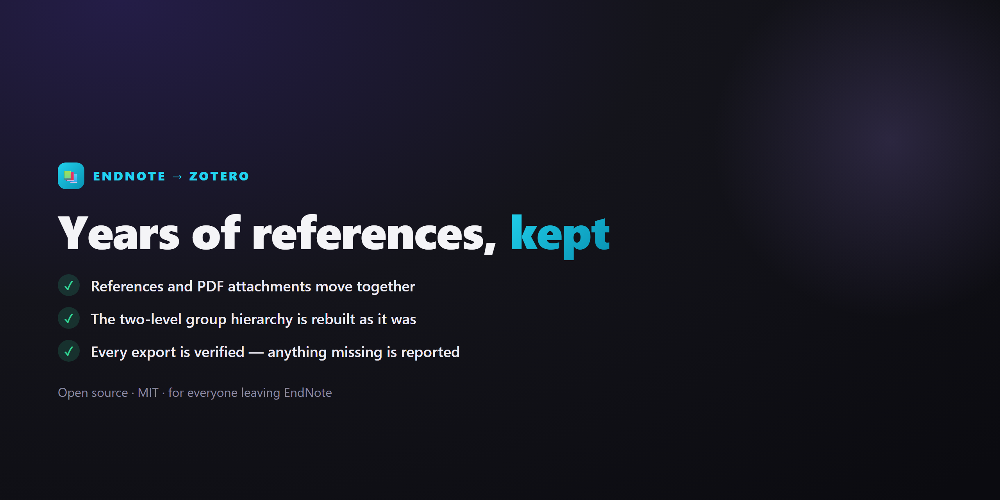

# EndNote → Zotero migration

[繁體中文](README.md) · **English**

Move your **references, PDF attachments and group hierarchy** out of EndNote and into Zotero — a manual, a set of scripts, and an AI skill.

Tested on a real library: 2,257 references, 30 group sets / 366 groups, 1,952 PDFs, group structure rebuilt 100%.

> **If you are at NTU:** the campus EndNote licence ends 1 November 2026 (民國 115 年), and you are asked to back up and migrate before 31 October. Check the library announcement for the authoritative dates.

## Read this first

**The detailed manual (`docs/`) is in Traditional Chinese.** This page carries the whole procedure in English — the nine steps, the three mistakes that cost you data, and the troubleshooting table — so you can finish without reading it.

If you would rather be walked through it, the **AI agent path works in English**: the instructions the agent reads are Chinese, but it will talk to you in whatever language you write in. See [Using an AI agent](#using-an-ai-agent-optional).

| Your situation | Start here |
|---|---|
| **You have a Word manuscript in progress** | **Do this first** — see [Word manuscripts](#word-manuscripts-do-this-before-anything-else). More urgent than moving the library. |
| You want to move the library | The nine steps below |
| You just want the scripts | [Scripts](#the-nine-steps) |

## Do you even need this?

| Your situation | What to do |
|---|---|
| Fewer than ~10 groups, or you never used groups | **You do not need these scripts.** Export each group to XML and import them one at a time. |
| Many groups, and you can run Python | Use these scripts |
| Many groups, but you would rather not touch code | Per-group export still works — it is just repetitive |

**Why the scripts exist:** when Zotero imports an EndNote XML, the references and PDFs come across but **the groups do not**. The official workaround is to export and import one group at a time, which is fine for ten groups and miserable for three hundred — and references filed in several groups get imported repeatedly.

These scripts do it differently: **export the whole library once → read the group structure straight out of the EndNote database → rebuild it inside Zotero.**

> Per-group export gives you a **flat** list of collections. These scripts rebuild the **two-level group set → group** hierarchy, matching what you had in EndNote.

## Requirements

- **Python 3.8+** — the `python3` that ships with macOS is usually enough. On macOS the command is `python3`, not `python`.
- **Zotero 7+** — needs `Tools → Developer → Run JavaScript`
- **EndNote X9.3+** — older versions do not store the library as SQLite and cannot be read

No Python packages to install; standard library only.

## Safety

**These scripts do not modify your EndNote library.**

| Script | EndNote | Zotero |
|---|---|---|
| `export_endnote_groups.py` | opened read-only (SQLite `mode=ro`, enforced by the database) | untouched |
| `verify_export_xml.py` | reads the XML, checks files exist | untouched |
| `build_collection_plan.py` | untouched | opened read-only (`immutable=1`) |
| `rebuild_collections.js` | untouched | **adds** collections and files references into them; deletes nothing, edits no reference |
| `cleanup_endnote_notes.js` | untouched | moves leftover import notes **to the trash** (recoverable) |
| `rename_attachments.js` | untouched | renames stored PDF attachments only; skips linked files, appends a number on conflict rather than overwriting |

If something goes wrong halfway, your EndNote library is intact and you can start over.

**Back up anyway.** Copy your EndNote library and your Zotero data directory before you begin. Read-only is not a substitute for a backup.

### Known limits

- **The three `.js` scripts only touch My Library.** `Zotero.Libraries.userLibraryID` is hard-coded, so **group libraries are not processed** — not for collection rebuilding, note cleanup, or renaming. EndNote content lands in My Library on import, so this rarely matters; but if you plan to move references into a shared lab group, **finish the whole migration first and move them last**.
- **EndNote's Figure field does not transfer.** Save those images out by hand first.
- **Smart Groups do not transfer** — they are saved queries, not fixed lists. Rebuild them as Saved Searches in Zotero.

## Word manuscripts: do this before anything else

If you have a thesis or paper in progress with EndNote citation fields in it, **handle the manuscript before you migrate the library**. Citations in a Word document point at EndNote's own record numbers; once you have moved to Zotero those references still exist, but the link from the document is gone.

The Chinese manual covers this in [`docs/01_Word舊稿必讀.md`](docs/01_Word舊稿必讀.md) ([PDF](pdf/01_Word舊稿必讀.pdf)). The short version: **make an unformatted copy of your manuscript, and keep a formatted PDF, before you touch anything else.** If you are mid-submission, finish the submission on EndNote and migrate afterwards.

## The nine steps

| # | Command / action |
|---|---|
| 1 | Find the library you are **actually using** — most machines have several copies |
| 2 | Install Zotero and the Zoplicate plugin |
| 3 | Decide where attachments will live |
| 4 | `export_endnote_groups.py <sdb.eni> snapshot.json` |
| 5 | Export XML from EndNote → **save it inside the `.Data` folder** → `verify_export_xml.py <xml> snapshot.json <.Data>` |
| 6 | Turn Zotero auto-sync **off** → `File → Import` |
| 7 | **Quit Zotero** → `build_collection_plan.py snapshot.json <zotero.sqlite> plan.json [root name]` → reopen Zotero → `Run JavaScript`, paste `rebuild_collections.js` (**edit `planPath` on the first line**) |
| 8 | Merge duplicates with Zoplicate → `cleanup_endnote_notes.js` → optionally `rename_attachments.js` |
| 9 | Turn sync back on → back up to the cloud |

**On macOS:** use `python3` instead of `python`, forward slashes in paths, no `PYTHONIOENCODING` needed, and no doubled backslashes in `planPath`.

### The three mistakes that actually cost you data

1. **The XML must be saved inside `<library>.Data`.** Save it anywhere else and every reference imports fine while **every PDF is silently missing**.
2. **Quit Zotero before running `build_collection_plan.py`.** It opens the database with `immutable=1`; reading it while Zotero is running returns inconsistent data.
3. **Tick "Run as async function" in the Run JavaScript window.** Without it the script always errors.

## Troubleshooting

| Symptom | Cause | Fix |
|---|---|---|
| References imported, no PDFs | XML was not inside the `.Data` folder | Delete that import batch, move the XML into `.Data`, import again |
| All groups have disappeared | Expected | Zotero's import does not carry groups; steps 7–8 rebuild them |
| Import crawls or hangs | Too much at once with sync on | Turn sync off, import in batches of 500–1,000 |
| A pile of strange notes appeared | EndNote fields Zotero has no home for get dumped into notes | Run `cleanup_endnote_notes.js` |
| Non-Latin text is mojibake | XML encoding | Set EndNote's export encoding to Unicode (UTF-8) |
| Python errors when printing non-Latin text | Windows console defaults to a legacy codepage | Set `PYTHONIOENCODING=utf-8` |
| Script counts do not match what EndNote shows | You are reading an old backup library | Go back to step 1 and confirm which library is live |

## Using an AI agent (optional)

The repo ships agent instructions. The agent follows the same nine steps and **stops whenever a count does not match**.

**This is the most practical path if you do not read Chinese** — the instruction files are Chinese, but the agent replies in the language you write in, and it has the full manual available while you only have this page.

> **Requires a paid subscription**: Claude Code needs Claude Pro/Max, Codex needs ChatGPT Plus/Pro, or use API billing instead. From about US$20/month.
> **You do not need it.** Every step is designed to be completed by hand. The AI is an accelerator, not a requirement.

**1. Get the repo onto your machine**

```bash
git clone https://github.com/a0972210123/endnote-to-zotero-migration.git
cd endnote-to-zotero-migration
```

Not a git user? On the web page click **Code → Download ZIP**, unzip it, and open that folder.

**2. Start your agent inside that folder**

```bash
claude      # Claude Code
codex       # Codex
```

> **It must be started inside the repo folder** or it will not find the instructions and will not know to follow this procedure.

| Tool | Reads | Setup |
|---|---|---|
| Claude Code | `.claude/skills/endnote-to-zotero/SKILL.md` | none, loads automatically |
| Codex | `AGENTS.md` | none, loads automatically |
| Anything else | paste the contents of `AGENTS.md` | manual |

**3. Open with something like this**

```
I need to migrate from EndNote to Zotero. Please walk me through this repo's
procedure. My library has roughly 2,000 references and 100 groups, and I'm on
Windows. Please reply in English, go one step at a time, and wait for me to
confirm before moving on.
```

It will ask about a Word manuscript first — that is more urgent than the library, so deal with it when asked.

When you get stuck, paste the actual message:

```
I'm stuck at the verification step. It printed missing: 1952. What does that
mean and how do I fix it?
```

When you do not understand a step, ask instead of guessing:

```
What did that step just do, and why does Zotero have to be closed first?
```

Coming back after a break:

```
Yesterday I finished the import. snapshot.json and plan.json still exist.
What's next?
```

### Three things to keep in mind

1. **The agent can be wrong.** It asks you to confirm each step — if you do not understand one, ask what it does. Do not click through because an AI said so.
2. **It cannot touch your EndNote library.** The scripts open EndNote read-only at the database level; the agent could not write to it if it tried.
3. **It should stop when counts disagree.** If numbers do not match and it says "that's fine, let's continue", that is wrong. Tell it to stop and check again.

## Licence

MIT — see [LICENSE](LICENSE). Author: Ching-Wei Ye (葉淨維).

Back up your EndNote library and Zotero data directory before you start. The scripts are read-only against EndNote and only add recoverable changes to Zotero, but back up before any data migration regardless.
